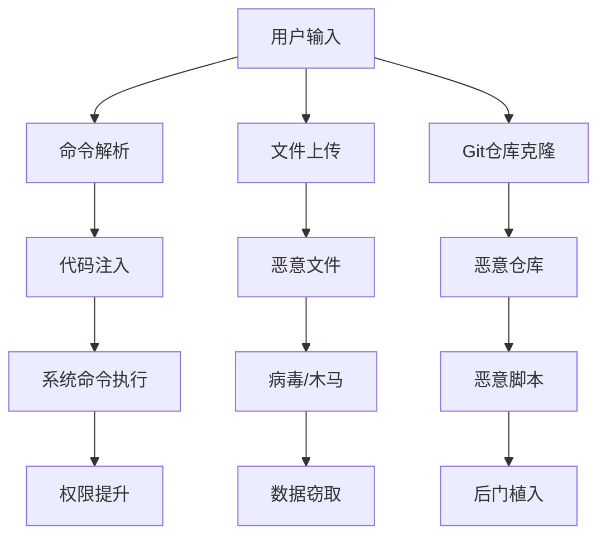

# 设计文档 08: 安全隔离和沙箱机制

## 概述

本文档设计了Claude Web应用的安全隔离和沙箱机制，确保Claude CLI命令执行的安全性，防止恶意代码执行、资源滥用和系统入侵。

## 目录
1. [安全威胁分析](#安全威胁分析)
2. [多层安全架构](#多层安全架构)  
3. [容器沙箱设计](#容器沙箱设计)
4. [资源限制机制](#资源限制机制)
5. [网络隔离策略](#网络隔离策略)
6. [文件系统安全](#文件系统安全)
7. [权限控制系统](#权限控制系统)
8. [监控和审计](#监控和审计)
9. [应急响应机制](#应急响应机制)

## 安全威胁分析

### 主要威胁类型

1. **代码注入攻击**
   - 恶意命令注入
   - 脚本代码执行
   - 环境变量污染

2. **资源滥用攻击**
   - CPU/内存耗尽
   - 磁盘空间占用
   - 网络带宽滥用

3. **权限提升攻击**
   - 容器逃逸
   - 主机系统访问
   - 敏感信息泄露

4. **拒绝服务攻击**
   - 长时间任务阻塞
   - 并发连接耗尽
   - 系统资源竞争

### 攻击向量



## 多层安全架构

### 安全边界设计

```python
# app/core/security/layers.py
from enum import Enum
from typing import List, Dict
from dataclasses import dataclass

class SecurityLayer(Enum):
    """安全层级定义"""
    NETWORK = "network"
    APPLICATION = "application"
    CONTAINER = "container"
    PROCESS = "process"
    FILE_SYSTEM = "filesystem"

@dataclass
class SecurityPolicy:
    """安全策略配置"""
    layer: SecurityLayer
    rules: List[str]
    enforcement: str
    monitoring: bool
    logging: bool

class SecurityManager:
    """安全管理器"""
    
    def __init__(self):
        self.policies: Dict[SecurityLayer, SecurityPolicy] = {}
        self.violations: List[Dict] = []
    
    def register_policy(self, policy: SecurityPolicy):
        """注册安全策略"""
        self.policies[policy.layer] = policy
    
    def enforce_policies(self, context: Dict) -> bool:
        """执行安全策略检查"""
        for layer, policy in self.policies.items():
            if not self._check_policy(policy, context):
                self._log_violation(layer, context)
                return False
        return True
    
    def _check_policy(self, policy: SecurityPolicy, context: Dict) -> bool:
        """检查单个策略"""
        # 实现策略检查逻辑
        pass
    
    def _log_violation(self, layer: SecurityLayer, context: Dict):
        """记录安全违规"""
        violation = {
            "timestamp": datetime.now(),
            "layer": layer.value,
            "context": context,
            "severity": "high"
        }
        self.violations.append(violation)
```

### 安全检查点

```python
# app/core/security/checkpoints.py
from typing import Any, Dict, List
from abc import ABC, abstractmethod

class SecurityCheckpoint(ABC):
    """安全检查点基类"""
    
    @abstractmethod
    def check(self, data: Any) -> Dict[str, Any]:
        """执行安全检查"""
        pass

class CommandSanitizer(SecurityCheckpoint):
    """命令安全检查"""
    
    DANGEROUS_COMMANDS = [
        'rm -rf', 'dd if=', 'mkfs', 'fdisk',
        'su', 'sudo', 'passwd', 'useradd',
        'iptables', 'systemctl', 'service'
    ]
    
    DANGEROUS_PATTERNS = [
        r'[;&|`$()]',  # 命令分隔符和变量替换
        r'>\s*/dev/',  # 设备文件重定向
        r'<\s*/proc/', # proc文件系统读取
        r'/etc/passwd|/etc/shadow'  # 敏感文件访问
    ]
    
    def check(self, command: str) -> Dict[str, Any]:
        """检查命令安全性"""
        violations = []
        
        # 检查危险命令
        for dangerous in self.DANGEROUS_COMMANDS:
            if dangerous in command.lower():
                violations.append(f"Dangerous command: {dangerous}")
        
        # 检查危险模式
        import re
        for pattern in self.DANGEROUS_PATTERNS:
            if re.search(pattern, command):
                violations.append(f"Dangerous pattern: {pattern}")
        
        return {
            "safe": len(violations) == 0,
            "violations": violations,
            "sanitized_command": self._sanitize(command) if violations else command
        }
    
    def _sanitize(self, command: str) -> str:
        """命令清理"""
        # 移除危险字符和命令
        import re
        sanitized = re.sub(r'[;&|`]', '', command)
        return sanitized

class FilePathValidator(SecurityCheckpoint):
    """文件路径验证"""
    
    ALLOWED_PATHS = ['/tmp/claude-workspace', '/app/projects']
    FORBIDDEN_PATHS = ['/etc', '/proc', '/sys', '/dev']
    
    def check(self, path: str) -> Dict[str, Any]:
        """检查文件路径安全性"""
        import os
        
        # 规范化路径
        normalized_path = os.path.normpath(path)
        
        # 检查路径遍历
        if '..' in normalized_path or normalized_path.startswith('/..'):
            return {
                "safe": False,
                "violations": ["Path traversal detected"],
                "normalized_path": None
            }
        
        # 检查允许路径
        allowed = any(normalized_path.startswith(allowed) 
                     for allowed in self.ALLOWED_PATHS)
        
        # 检查禁止路径
        forbidden = any(normalized_path.startswith(forbidden) 
                       for forbidden in self.FORBIDDEN_PATHS)
        
        return {
            "safe": allowed and not forbidden,
            "violations": [] if allowed and not forbidden else [
                f"Path not allowed: {normalized_path}"
            ],
            "normalized_path": normalized_path if allowed and not forbidden else None
        }
```

## 容器沙箱设计

### Docker容器配置

```yaml
# deployment/docker/sandbox/Dockerfile
FROM ubuntu:22.04

# 创建非特权用户
RUN groupadd -r claudeuser && useradd -r -g claudeuser claudeuser

# 安装必要工具
RUN apt-get update && apt-get install -y \
    python3 \
    python3-pip \
    nodejs \
    npm \
    git \
    curl \
    wget \
    && rm -rf /var/lib/apt/lists/*

# 创建工作目录
RUN mkdir -p /app/workspace && \
    chown -R claudeuser:claudeuser /app/workspace

# 设置资源限制
RUN echo "claudeuser soft nproc 100" >> /etc/security/limits.conf && \
    echo "claudeuser hard nproc 200" >> /etc/security/limits.conf && \
    echo "claudeuser soft nofile 1024" >> /etc/security/limits.conf && \
    echo "claudeuser hard nofile 2048" >> /etc/security/limits.conf

# 复制Claude CLI
COPY --chown=claudeuser:claudeuser claude-cli /usr/local/bin/

USER claudeuser
WORKDIR /app/workspace

CMD ["/bin/bash"]
```

### 容器运行时配置

```python
# app/services/sandbox/container.py
from typing import Dict, List, Optional
import docker
from docker.models.containers import Container

class SandboxContainer:
    """沙箱容器管理"""
    
    def __init__(self, docker_client: docker.DockerClient):
        self.client = docker_client
        self.active_containers: Dict[str, Container] = {}
    
    def create_sandbox(self, 
                      user_id: str,
                      project_id: str,
                      resources: Dict = None) -> str:
        """创建沙箱容器"""
        
        container_name = f"claude-sandbox-{user_id}-{project_id}"
        
        # 默认资源限制
        default_resources = {
            "cpu_limit": "1.0",  # 1 CPU核心
            "memory_limit": "512m",  # 512MB内存
            "disk_limit": "1g",  # 1GB磁盘
            "network": "none",   # 无网络访问
            "timeout": 3600     # 1小时超时
        }
        
        if resources:
            default_resources.update(resources)
        
        # 容器配置
        container_config = {
            "image": "claude-sandbox:latest",
            "name": container_name,
            "detach": True,
            "remove": True,
            "mem_limit": default_resources["memory_limit"],
            "cpu_quota": int(float(default_resources["cpu_limit"]) * 100000),
            "cpu_period": 100000,
            "network_mode": default_resources["network"],
            "cap_drop": ["ALL"],  # 移除所有特权
            "security_opt": ["no-new-privileges"],
            "read_only": True,
            "tmpfs": {
                "/tmp": "noexec,nosuid,size=100m",
                "/app/workspace": "noexec,nosuid,size=" + default_resources["disk_limit"]
            },
            "environment": {
                "USER": "claudeuser",
                "HOME": "/app/workspace",
                "PATH": "/usr/local/bin:/usr/bin:/bin"
            }
        }
        
        try:
            container = self.client.containers.run(**container_config)
            self.active_containers[container_name] = container
            
            # 设置自动清理
            self._schedule_cleanup(container_name, default_resources["timeout"])
            
            return container_name
            
        except Exception as e:
            raise SandboxError(f"Failed to create sandbox: {e}")
    
    def execute_command(self, 
                       container_name: str, 
                       command: str,
                       timeout: int = 300) -> Dict:
        """在沙箱中执行命令"""
        
        if container_name not in self.active_containers:
            raise SandboxError("Container not found")
        
        container = self.active_containers[container_name]
        
        try:
            # 执行命令
            exec_result = container.exec_run(
                cmd=command,
                user="claudeuser",
                workdir="/app/workspace",
                timeout=timeout
            )
            
            return {
                "exit_code": exec_result.exit_code,
                "output": exec_result.output.decode('utf-8'),
                "success": exec_result.exit_code == 0
            }
            
        except Exception as e:
            return {
                "exit_code": -1,
                "output": f"Execution error: {e}",
                "success": False
            }
    
    def destroy_sandbox(self, container_name: str):
        """销毁沙箱容器"""
        if container_name in self.active_containers:
            container = self.active_containers[container_name]
            container.stop(timeout=10)
            container.remove()
            del self.active_containers[container_name]
```

## 资源限制机制

### 系统资源控制

```python
# app/core/security/resources.py
from typing import Dict, Optional
import psutil
import threading
import time
from dataclasses import dataclass

@dataclass
class ResourceLimits:
    """资源限制配置"""
    cpu_percent: float = 50.0  # CPU使用率限制
    memory_mb: int = 512       # 内存限制(MB)
    disk_mb: int = 1024        # 磁盘空间限制(MB)
    network_mbps: float = 10.0 # 网络带宽限制(Mbps)
    max_processes: int = 50    # 最大进程数
    max_files: int = 1000      # 最大文件数

class ResourceMonitor:
    """资源监控器"""
    
    def __init__(self, limits: ResourceLimits):
        self.limits = limits
        self.monitoring = False
        self.violations: List[Dict] = []
        self._monitor_thread: Optional[threading.Thread] = None
    
    def start_monitoring(self, container_id: str):
        """开始资源监控"""
        self.monitoring = True
        self._monitor_thread = threading.Thread(
            target=self._monitor_loop,
            args=(container_id,),
            daemon=True
        )
        self._monitor_thread.start()
    
    def stop_monitoring(self):
        """停止资源监控"""
        self.monitoring = False
        if self._monitor_thread:
            self._monitor_thread.join(timeout=5)
    
    def _monitor_loop(self, container_id: str):
        """监控循环"""
        while self.monitoring:
            try:
                # 获取容器资源使用情况
                stats = self._get_container_stats(container_id)
                
                # 检查资源使用是否超限
                violations = self._check_resource_limits(stats)
                
                if violations:
                    self.violations.extend(violations)
                    self._handle_violations(container_id, violations)
                
                time.sleep(5)  # 每5秒检查一次
                
            except Exception as e:
                print(f"Resource monitoring error: {e}")
    
    def _get_container_stats(self, container_id: str) -> Dict:
        """获取容器资源统计"""
        # 这里应该通过Docker API获取实际的容器统计信息
        return {
            "cpu_percent": psutil.cpu_percent(interval=1),
            "memory_mb": psutil.virtual_memory().used / (1024 * 1024),
            "disk_mb": psutil.disk_usage('/').used / (1024 * 1024),
            "process_count": len(psutil.pids())
        }
    
    def _check_resource_limits(self, stats: Dict) -> List[Dict]:
        """检查资源限制"""
        violations = []
        
        if stats["cpu_percent"] > self.limits.cpu_percent:
            violations.append({
                "type": "cpu_limit",
                "current": stats["cpu_percent"],
                "limit": self.limits.cpu_percent,
                "severity": "high"
            })
        
        if stats["memory_mb"] > self.limits.memory_mb:
            violations.append({
                "type": "memory_limit",
                "current": stats["memory_mb"],
                "limit": self.limits.memory_mb,
                "severity": "high"
            })
        
        if stats["process_count"] > self.limits.max_processes:
            violations.append({
                "type": "process_limit",
                "current": stats["process_count"],
                "limit": self.limits.max_processes,
                "severity": "medium"
            })
        
        return violations
    
    def _handle_violations(self, container_id: str, violations: List[Dict]):
        """处理资源违规"""
        for violation in violations:
            if violation["severity"] == "high":
                # 高严重级别：立即停止容器
                self._emergency_stop_container(container_id)
                break
            elif violation["severity"] == "medium":
                # 中等级别：发送警告
                self._send_warning(container_id, violation)
```

## 网络隔离策略

### 网络安全配置

```python
# app/core/security/network.py
from typing import Dict, List, Set
from ipaddress import ip_network, ip_address
import iptables

class NetworkIsolation:
    """网络隔离管理"""
    
    def __init__(self):
        self.allowed_domains: Set[str] = set()
        self.blocked_domains: Set[str] = set()
        self.allowed_ips: Set[str] = set()
        self.blocked_ips: Set[str] = set()
    
    def setup_container_network(self, container_id: str, policy: Dict):
        """设置容器网络策略"""
        
        # 创建专用网络
        network_name = f"claude-net-{container_id[:12]}"
        
        network_config = {
            "driver": "bridge",
            "options": {
                "com.docker.network.bridge.enable_icc": "false",
                "com.docker.network.bridge.enable_ip_masquerade": "true"
            },
            "ipam": {
                "driver": "default",
                "config": [
                    {
                        "subnet": "172.20.0.0/24",
                        "gateway": "172.20.0.1"
                    }
                ]
            }
        }
        
        # 应用网络策略
        if policy.get("internet_access", False):
            self._configure_internet_access(network_name, policy)
        else:
            self._configure_no_internet(network_name)
    
    def _configure_internet_access(self, network_name: str, policy: Dict):
        """配置受限的互联网访问"""
        
        # 允许的域名和IP
        allowed_domains = policy.get("allowed_domains", [])
        allowed_ips = policy.get("allowed_ips", [])
        
        # 配置DNS过滤
        dns_config = {
            "primary": "8.8.8.8",
            "secondary": "8.8.4.4",
            "filter_domains": True,
            "allowed_domains": allowed_domains
        }
        
        # 配置防火墙规则
        firewall_rules = [
            # 默认拒绝所有出站流量
            "OUTPUT -j DROP",
            
            # 允许本地回环
            "OUTPUT -o lo -j ACCEPT",
            
            # 允许已建立的连接
            "OUTPUT -m state --state ESTABLISHED,RELATED -j ACCEPT",
            
            # 允许DNS查询
            "OUTPUT -p udp --dport 53 -j ACCEPT",
            "OUTPUT -p tcp --dport 53 -j ACCEPT",
        ]
        
        # 添加允许的IP规则
        for ip in allowed_ips:
            firewall_rules.append(f"OUTPUT -d {ip} -j ACCEPT")
        
        # 允许HTTP/HTTPS到白名单域名
        if allowed_domains:
            firewall_rules.extend([
                "OUTPUT -p tcp --dport 80 -j ACCEPT",
                "OUTPUT -p tcp --dport 443 -j ACCEPT"
            ])
    
    def _configure_no_internet(self, network_name: str):
        """配置无互联网访问"""
        
        firewall_rules = [
            # 只允许本地回环
            "OUTPUT -o lo -j ACCEPT",
            
            # 拒绝所有其他流量
            "OUTPUT -j DROP"
        ]
    
    def monitor_network_traffic(self, container_id: str):
        """监控网络流量"""
        
        # 实现网络流量监控
        pass

class DNSFilter:
    """DNS过滤器"""
    
    def __init__(self, allowed_domains: List[str]):
        self.allowed_domains = set(allowed_domains)
        self.blocked_requests: List[Dict] = []
    
    def filter_dns_request(self, domain: str) -> bool:
        """过滤DNS请求"""
        
        # 检查是否在允许列表中
        if domain in self.allowed_domains:
            return True
        
        # 检查是否为允许域名的子域名
        for allowed in self.allowed_domains:
            if domain.endswith(f".{allowed}"):
                return True
        
        # 记录被阻止的请求
        self.blocked_requests.append({
            "domain": domain,
            "timestamp": datetime.now(),
            "reason": "not_in_allowlist"
        })
        
        return False
```

## 文件系统安全

### 文件访问控制

```python
# app/core/security/filesystem.py
import os
import stat
from typing import List, Dict, Optional
from pathlib import Path

class FileSystemSecurity:
    """文件系统安全管理"""
    
    def __init__(self, base_path: str):
        self.base_path = Path(base_path)
        self.allowed_extensions = {
            '.py', '.js', '.ts', '.json', '.yaml', '.yml',
            '.md', '.txt', '.csv', '.xml', '.html', '.css'
        }
        self.forbidden_extensions = {
            '.exe', '.bat', '.cmd', '.sh', '.ps1', '.scr',
            '.com', '.pif', '.msi', '.dll', '.so'
        }
        self.max_file_size = 100 * 1024 * 1024  # 100MB
    
    def validate_file_access(self, file_path: str, operation: str) -> Dict:
        """验证文件访问权限"""
        
        try:
            # 规范化路径
            normalized_path = self.base_path / Path(file_path).relative_to('/')
            
            # 检查路径遍历
            if not self._is_safe_path(normalized_path):
                return {
                    "allowed": False,
                    "reason": "path_traversal_detected",
                    "normalized_path": None
                }
            
            # 检查文件扩展名
            if not self._is_allowed_extension(normalized_path):
                return {
                    "allowed": False,
                    "reason": "forbidden_file_type",
                    "normalized_path": None
                }
            
            # 检查文件大小
            if operation in ['write', 'create'] and normalized_path.exists():
                if not self._is_allowed_size(normalized_path):
                    return {
                        "allowed": False,
                        "reason": "file_too_large",
                        "normalized_path": None
                    }
            
            # 检查操作权限
            if not self._check_operation_permission(normalized_path, operation):
                return {
                    "allowed": False,
                    "reason": "operation_not_permitted",
                    "normalized_path": None
                }
            
            return {
                "allowed": True,
                "reason": "access_granted",
                "normalized_path": str(normalized_path)
            }
            
        except Exception as e:
            return {
                "allowed": False,
                "reason": f"validation_error: {e}",
                "normalized_path": None
            }
    
    def _is_safe_path(self, path: Path) -> bool:
        """检查路径是否安全"""
        try:
            # 检查是否在基础路径内
            path.resolve().relative_to(self.base_path.resolve())
            return True
        except ValueError:
            return False
    
    def _is_allowed_extension(self, path: Path) -> bool:
        """检查文件扩展名是否允许"""
        extension = path.suffix.lower()
        
        if extension in self.forbidden_extensions:
            return False
        
        # 如果有白名单且不在白名单中
        if self.allowed_extensions and extension not in self.allowed_extensions:
            return False
        
        return True
    
    def _is_allowed_size(self, path: Path) -> bool:
        """检查文件大小是否允许"""
        try:
            if path.exists():
                size = path.stat().st_size
                return size <= self.max_file_size
        except OSError:
            pass
        return True
    
    def _check_operation_permission(self, path: Path, operation: str) -> bool:
        """检查操作权限"""
        
        if operation == 'read':
            return path.exists() and os.access(path, os.R_OK)
        elif operation == 'write':
            if path.exists():
                return os.access(path, os.W_OK)
            else:
                # 检查父目录写权限
                return os.access(path.parent, os.W_OK)
        elif operation == 'create':
            return os.access(path.parent, os.W_OK)
        elif operation == 'delete':
            return path.exists() and os.access(path, os.W_OK)
        
        return False

class FileContentScanner:
    """文件内容扫描器"""
    
    def __init__(self):
        self.virus_signatures = []  # 病毒特征码
        self.malware_patterns = [
            r'eval\s*\(',
            r'exec\s*\(',
            r'__import__\s*\(',
            r'os\.system\s*\(',
            r'subprocess\.',
            r'shell=True'
        ]
    
    def scan_file(self, file_path: Path) -> Dict:
        """扫描文件内容"""
        
        scan_result = {
            "safe": True,
            "threats": [],
            "warnings": []
        }
        
        try:
            with open(file_path, 'rb') as f:
                content = f.read()
            
            # 检查二进制文件头
            if self._is_executable(content):
                scan_result["threats"].append("executable_file_detected")
                scan_result["safe"] = False
            
            # 检查文本内容中的恶意模式
            try:
                text_content = content.decode('utf-8', errors='ignore')
                malware_matches = self._scan_malware_patterns(text_content)
                if malware_matches:
                    scan_result["warnings"].extend(malware_matches)
            except Exception:
                pass
            
            return scan_result
            
        except Exception as e:
            return {
                "safe": False,
                "threats": [f"scan_error: {e}"],
                "warnings": []
            }
    
    def _is_executable(self, content: bytes) -> bool:
        """检查是否为可执行文件"""
        
        # 常见可执行文件头
        executable_headers = [
            b'\x7fELF',      # Linux ELF
            b'MZ',           # Windows PE
            b'\xCA\xFE\xBA\xBE',  # Mach-O
            b'#!/bin/',      # Shell脚本
            b'#!/usr/bin/',  # Shell脚本
        ]
        
        for header in executable_headers:
            if content.startswith(header):
                return True
        
        return False
    
    def _scan_malware_patterns(self, text: str) -> List[str]:
        """扫描恶意代码模式"""
        import re
        
        matches = []
        for pattern in self.malware_patterns:
            if re.search(pattern, text, re.IGNORECASE):
                matches.append(f"suspicious_pattern: {pattern}")
        
        return matches
```

## 权限控制系统

### 沙箱权限模型

```python
# app/core/security/permissions.py
from enum import Enum
from typing import Dict, List, Set
from dataclasses import dataclass

class Permission(Enum):
    """权限类型"""
    FILE_READ = "file:read"
    FILE_WRITE = "file:write"
    FILE_CREATE = "file:create"
    FILE_DELETE = "file:delete"
    NETWORK_ACCESS = "network:access"
    SYSTEM_INFO = "system:info"
    PROCESS_CREATE = "process:create"
    
class SandboxPermission:
    """沙箱权限管理"""
    
    def __init__(self):
        self.user_permissions: Dict[str, Set[Permission]] = {}
        self.resource_permissions: Dict[str, Dict[Permission, bool]] = {}
    
    def grant_permission(self, user_id: str, permission: Permission):
        """授予权限"""
        if user_id not in self.user_permissions:
            self.user_permissions[user_id] = set()
        self.user_permissions[user_id].add(permission)
    
    def revoke_permission(self, user_id: str, permission: Permission):
        """撤销权限"""
        if user_id in self.user_permissions:
            self.user_permissions[user_id].discard(permission)
    
    def check_permission(self, user_id: str, permission: Permission, resource: str = None) -> bool:
        """检查权限"""
        
        # 检查用户基础权限
        user_perms = self.user_permissions.get(user_id, set())
        if permission not in user_perms:
            return False
        
        # 检查资源特定权限
        if resource and resource in self.resource_permissions:
            resource_perms = self.resource_permissions[resource]
            return resource_perms.get(permission, False)
        
        return True
    
    def get_sandbox_capabilities(self, user_id: str) -> List[str]:
        """获取沙箱能力列表"""
        
        user_perms = self.user_permissions.get(user_id, set())
        capabilities = []
        
        # 根据权限生成Docker capabilities
        if Permission.NETWORK_ACCESS in user_perms:
            capabilities.append("NET_RAW")
        
        if Permission.SYSTEM_INFO in user_perms:
            capabilities.append("SYS_PTRACE")
        
        # 默认移除危险capabilities
        drop_capabilities = [
            "SYS_ADMIN", "SYS_MODULE", "SYS_RAWIO",
            "SYS_PACCT", "SYS_NICE", "SYS_RESOURCE",
            "SYS_TIME", "SYS_TTY_CONFIG", "AUDIT_CONTROL",
            "MAC_ADMIN", "MAC_OVERRIDE", "NET_ADMIN",
            "SYSLOG", "DAC_READ_SEARCH", "LINUX_IMMUTABLE",
            "NET_BROADCAST", "IPC_LOCK", "IPC_OWNER",
            "SYS_PTRACE", "SYS_BOOT", "LEASE", "AUDIT_WRITE",
            "SETFCAP"
        ]
        
        return {
            "add": capabilities,
            "drop": drop_capabilities
        }
```

## 监控和审计

### 安全事件监控

```python
# app/core/security/monitoring.py
from typing import Dict, List, Optional
from datetime import datetime, timedelta
from enum import Enum
import json

class SecurityEventType(Enum):
    """安全事件类型"""
    UNAUTHORIZED_ACCESS = "unauthorized_access"
    RESOURCE_VIOLATION = "resource_violation"
    SUSPICIOUS_COMMAND = "suspicious_command"
    MALWARE_DETECTED = "malware_detected"
    CONTAINER_ESCAPE = "container_escape"
    NETWORK_VIOLATION = "network_violation"

@dataclass
class SecurityEvent:
    """安全事件"""
    event_type: SecurityEventType
    timestamp: datetime
    user_id: str
    container_id: Optional[str]
    details: Dict
    severity: str
    resolved: bool = False

class SecurityAuditor:
    """安全审计器"""
    
    def __init__(self):
        self.events: List[SecurityEvent] = []
        self.alert_thresholds = {
            SecurityEventType.UNAUTHORIZED_ACCESS: 5,  # 5次未授权访问
            SecurityEventType.RESOURCE_VIOLATION: 3,   # 3次资源违规
            SecurityEventType.SUSPICIOUS_COMMAND: 1,   # 1次可疑命令
        }
        self.time_window = timedelta(minutes=15)  # 15分钟时间窗口
    
    def log_event(self, event: SecurityEvent):
        """记录安全事件"""
        self.events.append(event)
        
        # 检查是否需要告警
        if self._should_alert(event):
            self._trigger_alert(event)
        
        # 清理老旧事件
        self._cleanup_old_events()
    
    def _should_alert(self, event: SecurityEvent) -> bool:
        """判断是否应该告警"""
        
        threshold = self.alert_thresholds.get(event.event_type)
        if not threshold:
            return False
        
        # 统计时间窗口内同类型事件数量
        cutoff_time = datetime.now() - self.time_window
        recent_events = [
            e for e in self.events
            if e.event_type == event.event_type and
               e.timestamp >= cutoff_time and
               e.user_id == event.user_id
        ]
        
        return len(recent_events) >= threshold
    
    def _trigger_alert(self, event: SecurityEvent):
        """触发安全告警"""
        
        alert = {
            "alert_id": f"sec_{event.timestamp.timestamp()}",
            "event_type": event.event_type.value,
            "user_id": event.user_id,
            "container_id": event.container_id,
            "timestamp": event.timestamp.isoformat(),
            "severity": event.severity,
            "message": f"Security alert: {event.event_type.value} for user {event.user_id}",
            "details": event.details
        }
        
        # 发送告警通知
        self._send_alert_notification(alert)
    
    def generate_audit_report(self, start_time: datetime, end_time: datetime) -> Dict:
        """生成审计报告"""
        
        filtered_events = [
            e for e in self.events
            if start_time <= e.timestamp <= end_time
        ]
        
        # 统计各类事件
        event_stats = {}
        for event_type in SecurityEventType:
            count = len([e for e in filtered_events if e.event_type == event_type])
            event_stats[event_type.value] = count
        
        # 高风险用户
        user_violations = {}
        for event in filtered_events:
            if event.user_id not in user_violations:
                user_violations[event.user_id] = 0
            user_violations[event.user_id] += 1
        
        high_risk_users = [
            user_id for user_id, count in user_violations.items()
            if count >= 10
        ]
        
        return {
            "report_period": {
                "start": start_time.isoformat(),
                "end": end_time.isoformat()
            },
            "total_events": len(filtered_events),
            "event_statistics": event_stats,
            "high_risk_users": high_risk_users,
            "unresolved_events": len([e for e in filtered_events if not e.resolved]),
            "severity_breakdown": {
                "high": len([e for e in filtered_events if e.severity == "high"]),
                "medium": len([e for e in filtered_events if e.severity == "medium"]),
                "low": len([e for e in filtered_events if e.severity == "low"])
            }
        }
```

## 应急响应机制

### 自动响应系统

```python
# app/core/security/incident_response.py
from typing import Dict, List, Callable
from enum import Enum
from datetime import datetime

class IncidentSeverity(Enum):
    """事件严重程度"""
    LOW = "low"
    MEDIUM = "medium" 
    HIGH = "high"
    CRITICAL = "critical"

class ResponseAction(Enum):
    """响应动作"""
    LOG_ONLY = "log_only"
    WARN_USER = "warn_user"
    SUSPEND_CONTAINER = "suspend_container"
    TERMINATE_CONTAINER = "terminate_container"
    BLOCK_USER = "block_user"
    EMERGENCY_SHUTDOWN = "emergency_shutdown"

class IncidentResponse:
    """事件响应系统"""
    
    def __init__(self):
        self.response_rules: Dict[SecurityEventType, List[Dict]] = {}
        self.active_incidents: List[Dict] = []
        self.response_handlers: Dict[ResponseAction, Callable] = {
            ResponseAction.LOG_ONLY: self._log_incident,
            ResponseAction.WARN_USER: self._warn_user,
            ResponseAction.SUSPEND_CONTAINER: self._suspend_container,
            ResponseAction.TERMINATE_CONTAINER: self._terminate_container,
            ResponseAction.BLOCK_USER: self._block_user,
            ResponseAction.EMERGENCY_SHUTDOWN: self._emergency_shutdown
        }
    
    def register_response_rule(self, 
                              event_type: SecurityEventType,
                              severity: IncidentSeverity,
                              action: ResponseAction,
                              condition: Callable = None):
        """注册响应规则"""
        
        if event_type not in self.response_rules:
            self.response_rules[event_type] = []
        
        rule = {
            "severity": severity,
            "action": action,
            "condition": condition,
            "created_at": datetime.now()
        }
        
        self.response_rules[event_type].append(rule)
    
    def handle_security_event(self, event: SecurityEvent):
        """处理安全事件"""
        
        # 确定事件严重程度
        severity = self._assess_severity(event)
        
        # 查找匹配的响应规则
        matching_rules = self._find_matching_rules(event, severity)
        
        # 创建事件记录
        incident = {
            "incident_id": f"inc_{datetime.now().timestamp()}",
            "event": event,
            "severity": severity,
            "timestamp": datetime.now(),
            "actions_taken": [],
            "resolved": False
        }
        
        # 执行响应动作
        for rule in matching_rules:
            try:
                action_result = self._execute_action(rule["action"], event)
                incident["actions_taken"].append({
                    "action": rule["action"].value,
                    "result": action_result,
                    "timestamp": datetime.now()
                })
            except Exception as e:
                incident["actions_taken"].append({
                    "action": rule["action"].value,
                    "result": f"error: {e}",
                    "timestamp": datetime.now()
                })
        
        self.active_incidents.append(incident)
        return incident
    
    def _assess_severity(self, event: SecurityEvent) -> IncidentSeverity:
        """评估事件严重程度"""
        
        # 基础严重程度映射
        base_severity = {
            SecurityEventType.UNAUTHORIZED_ACCESS: IncidentSeverity.MEDIUM,
            SecurityEventType.RESOURCE_VIOLATION: IncidentSeverity.LOW,
            SecurityEventType.SUSPICIOUS_COMMAND: IncidentSeverity.HIGH,
            SecurityEventType.MALWARE_DETECTED: IncidentSeverity.CRITICAL,
            SecurityEventType.CONTAINER_ESCAPE: IncidentSeverity.CRITICAL,
            SecurityEventType.NETWORK_VIOLATION: IncidentSeverity.MEDIUM
        }
        
        severity = base_severity.get(event.event_type, IncidentSeverity.LOW)
        
        # 根据事件详情调整严重程度
        if event.details.get("repeated_violation", False):
            severity = self._escalate_severity(severity)
        
        return severity
    
    def _find_matching_rules(self, 
                           event: SecurityEvent, 
                           severity: IncidentSeverity) -> List[Dict]:
        """查找匹配的响应规则"""
        
        rules = self.response_rules.get(event.event_type, [])
        matching_rules = []
        
        for rule in rules:
            # 检查严重程度匹配
            if rule["severity"].value != severity.value:
                continue
            
            # 检查条件匹配
            if rule["condition"] and not rule["condition"](event):
                continue
            
            matching_rules.append(rule)
        
        return matching_rules
    
    def _execute_action(self, action: ResponseAction, event: SecurityEvent) -> str:
        """执行响应动作"""
        
        handler = self.response_handlers.get(action)
        if handler:
            return handler(event)
        else:
            return f"No handler for action: {action.value}"
    
    def _log_incident(self, event: SecurityEvent) -> str:
        """记录事件"""
        # 实现事件日志记录
        return "incident_logged"
    
    def _warn_user(self, event: SecurityEvent) -> str:
        """警告用户"""
        # 发送警告通知给用户
        return "user_warned"
    
    def _suspend_container(self, event: SecurityEvent) -> str:
        """暂停容器"""
        if event.container_id:
            # 暂停容器执行
            return "container_suspended"
        return "no_container_to_suspend"
    
    def _terminate_container(self, event: SecurityEvent) -> str:
        """终止容器"""
        if event.container_id:
            # 强制终止容器
            return "container_terminated"
        return "no_container_to_terminate"
    
    def _block_user(self, event: SecurityEvent) -> str:
        """阻止用户"""
        # 临时阻止用户访问
        return "user_blocked"
    
    def _emergency_shutdown(self, event: SecurityEvent) -> str:
        """紧急关闭"""
        # 紧急关闭所有容器和服务
        return "emergency_shutdown_initiated"
```

## 总结

本设计文档全面覆盖了Claude Web应用的安全隔离和沙箱机制：

1. **多层安全架构**: 网络、应用、容器、进程、文件系统多层防护
2. **容器沙箱**: Docker容器隔离，资源限制，权限控制  
3. **文件系统安全**: 路径验证，文件类型检查，内容扫描
4. **网络隔离**: DNS过滤，防火墙规则，流量监控
5. **资源监控**: 实时监控CPU、内存、网络使用
6. **安全审计**: 事件记录，告警机制，审计报告
7. **应急响应**: 自动化响应，事件升级，紧急处理

这套安全机制确保了Claude CLI在受控环境中安全执行，有效防范各种安全威胁。