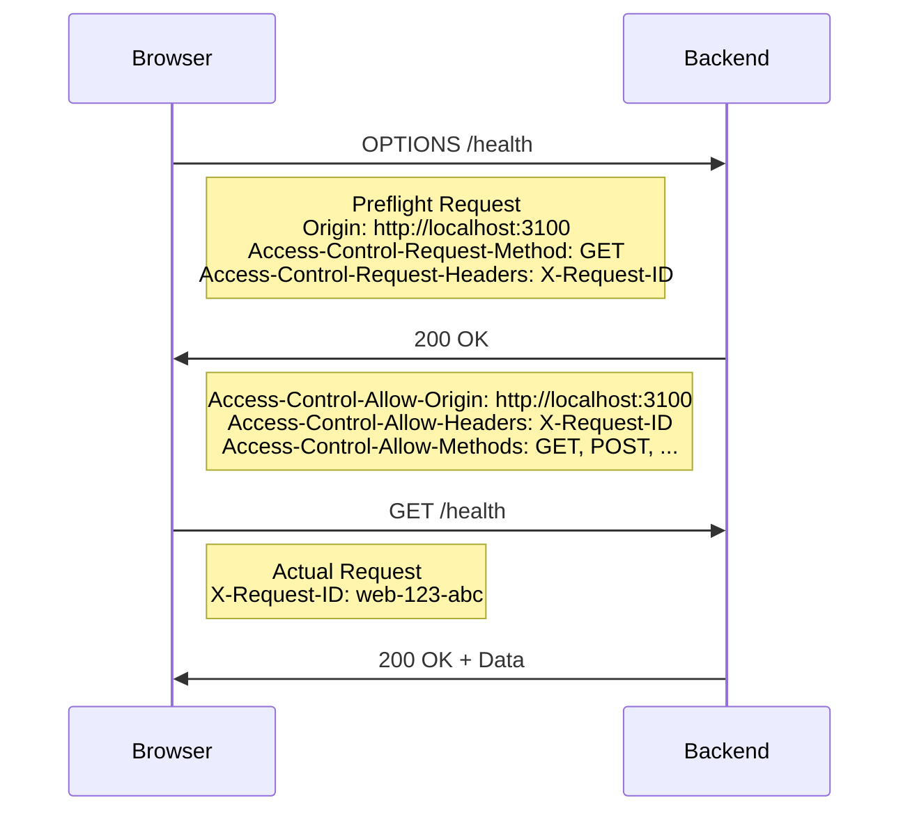

# CORS配置详解

## 概述

跨源资源共享（CORS）是一种机制，允许或拒绝来自不同源的Web应用程序访问资源。Claude Web项目中，前端运行在3100端口，后端运行在8100端口，需要正确配置CORS以确保前后端通信正常。

## 配置文件

### 后端CORS配置

**位置**: `backend/app/main.py`

```python
# CORS中间件
if settings.BACKEND_CORS_ORIGINS:
    app.add_middleware(
        CORSMiddleware,
        allow_origins=settings.BACKEND_CORS_ORIGINS,
        allow_credentials=True,
        allow_methods=["GET", "POST", "PUT", "DELETE", "OPTIONS"],
        allow_headers=[
            "Authorization",
            "Content-Type",
            "X-Requested-With",
            "Accept",
            "Origin",
            "User-Agent",
            "X-CSRF-Token",
            "X-Request-ID"  # 重要：前端发送的自定义请求ID
        ],
        expose_headers=["X-Total-Count", "X-Rate-Limit-*"],
    )
```

**位置**: `backend/app/core/config.py`

```python
# CORS Origins
BACKEND_CORS_ORIGINS: List[str] = [
    "http://localhost:3100",  # 前端开发服务器新端口
    "http://localhost:3000",  # 保持兼容
    "http://127.0.0.1:3100",
    "http://127.0.0.1:3000",
]
```

### 前端配置

**位置**: `frontend/src/lib/config.ts`

```javascript
// API配置
API_BASE_URL: getEnvVar(
  'API_BASE_URL',
  isTest ? 'http://localhost:8100' : 'http://localhost:8100'
),
```

**位置**: `frontend/src/lib/api.ts`

```javascript
// 请求拦截器中添加自定义头部
config.headers['X-Request-ID'] = `web-${Date.now()}-${Math.random().toString(36).substring(2, 9)}`
```

## CORS工作原理

### 简单请求 vs 预检请求

**简单请求**（不触发预检）：
- 方法：GET、HEAD、POST
- 头部：Accept、Accept-Language、Content-Language、Content-Type（限定值）
- Content-Type：application/x-www-form-urlencoded、multipart/form-data、text/plain

**预检请求**（需要预检）：
- 使用PUT、DELETE、PATCH等方法
- 包含自定义头部（如X-Request-ID）
- Content-Type为application/json

### Claude Web的情况

我们的API调用会触发预检请求，因为：
1. 使用了`Content-Type: application/json`
2. 添加了自定义头部`X-Request-ID`

## 预检请求流程



## 常见问题及解决方案

### 1. X-Request-ID头部被拒绝

**问题**: Preflight response is not successful. Status code: 400
**原因**: X-Request-ID未在allow_headers中
**解决**: 在CORS配置中添加"X-Request-ID"

### 2. 源域名不匹配

**问题**: CORS policy blocked
**原因**: 前端域名不在BACKEND_CORS_ORIGINS中
**解决**: 确保前端URL在允许的源列表中

### 3. 方法不被允许

**问题**: Method not allowed in CORS policy
**原因**: HTTP方法不在allow_methods中
**解决**: 添加所需的HTTP方法

## 开发环境vs生产环境

### 开发环境
```python
BACKEND_CORS_ORIGINS = [
    "http://localhost:3100",
    "http://localhost:3000", 
    "http://127.0.0.1:3100",
    "http://127.0.0.1:3000",
]
```

### 生产环境
```python
BACKEND_CORS_ORIGINS = [
    "https://claude-web.example.com",
    "https://www.claude-web.example.com",
]
```

## 调试CORS问题

### 1. 使用curl测试预检请求

```bash
curl -X OPTIONS \
  -H "Origin: http://localhost:3100" \
  -H "Access-Control-Request-Method: GET" \
  -H "Access-Control-Request-Headers: X-Request-ID" \
  http://localhost:8100/health -v
```

**成功响应**:
```
< HTTP/1.1 200 OK
< access-control-allow-origin: http://localhost:3100
< access-control-allow-methods: GET, POST, PUT, DELETE, OPTIONS
< access-control-allow-headers: ..., X-Request-ID, ...
< access-control-allow-credentials: true
```

### 2. 使用curl测试实际请求

```bash
curl 'http://localhost:8100/health' \
  -H 'Origin: http://localhost:3100' \
  -H 'X-Request-ID: web-test-123'
```

### 3. 浏览器开发者工具

1. 打开Network面板
2. 查看OPTIONS请求的响应头
3. 确认Access-Control-Allow-*头部正确返回

## 安全考虑

### 1. 限制允许的源

```python
# 不要使用通配符在生产环境
# allow_origins=["*"]  # 危险!

# 明确指定允许的域名
allow_origins=[
    "https://trusted-domain.com",
    "https://app.trusted-domain.com"
]
```

### 2. 最小权限原则

只允许必需的头部和方法：

```python
allow_methods=["GET", "POST"],  # 只允许需要的方法
allow_headers=[
    "Authorization",
    "Content-Type", 
    "X-Request-ID"  # 只允许必需的头部
]
```

### 3. 凭据处理

```python
allow_credentials=True  # 只在需要cookies/认证时启用
```

## 参考资源

- [MDN CORS文档](https://developer.mozilla.org/en-US/docs/Web/HTTP/CORS)
- [FastAPI CORS中间件文档](https://fastapi.tiangolo.com/tutorial/cors/)
- [CORS规范](https://www.w3.org/TR/cors/)